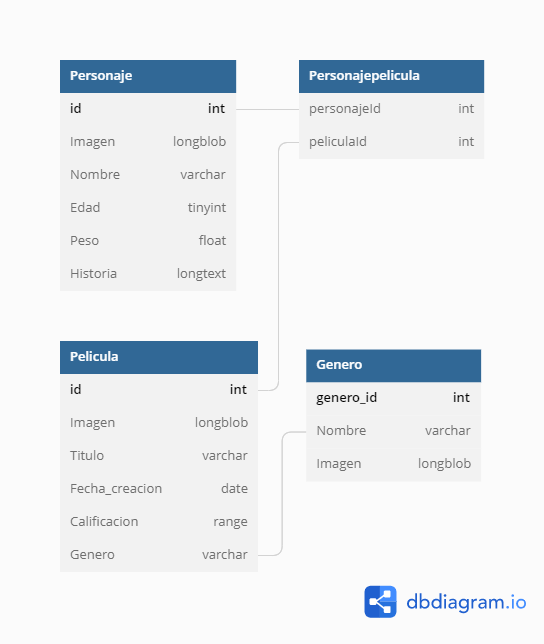

## Nodejs Sequelize RESTAPI MySQL

This is a simple REST API using Javascript Technologies and MySQL.

- NodeJS
- Express
- MySQL
- Sequelize

## Modeling

This is the basic relationship that we are using in this example

